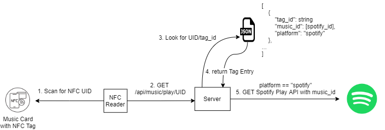

# Ongaku 音楽 ("Music")

Personal Vinyl Record Player  :notes:
- Generate your own Music Cards and listen with a simple tap!
- Every Music Card (NFC Tag) is linked to a Spotify song, playlist, or album

*Inspired* by [Spotify Vinyl Emulator](https://www.hackster.io/mark-hank/sonos-spotify-vinyl-emulator-3be63d)

## How it works?



1. A Music Card is pretty much a NFC Tag
   - NFC Reader scans the Music Card to read NFC UID
2. With the NFC UID, it makes an API call to the server to see what music to play
3. Server will look for the `music_id` and `platform` for the associated NFC UID (tag_id)
4. Based off the platform, it will make an API call to the associated platform API


## Server

### Getting Started

1. Login on `https://developer.spotify.com/dashboard/login` to setup your developer credentials

2. Create an app 

3. Go to `Edit Settings`

4. Add `http://localhost:8888/api/auth/spotify/callback ` in `Redirect URIs` section

5. Create a copy `.env.config` to `.env`
    ```sh
    cp .env.config .env
    ```

6. Create a copy of the Tags JSON
    ```sh
    cp ./server/data/tags.sample.json ./server/data/tags.json
    ```

7. Copy `Client ID` & `Client Secret` to `.env`
    ```sh
    # Credentials
    client_id='[your-client-id]'
    client_secret='[your-client-secret]'
    redirect_uri='http://localhost:8888/api/auth/spotify/callback '
    ```

8. Install the project with `npm install` and run application with `npm run start`

## Client

### Getting Started

```
npm install
npm run start
```

### Dashboard

#### See all Music Cards


- Using the `tags.json` as a database

#### Modify Music Card to link to a different Spotify URI


- Update the Spotify URI
  - You don't have to do anything to the Music Card
  - **Scan the Music Card and it will play the new tunes!**
- Update Title

#### Add new Music Card


- Tag ID is the UID of the NFC Tag
- Note: Currently, only Spotify is supported.

## NFC

### Getting Started

#### PN532 NFC Hat for Raspberry Pi

- https://www.waveshare.com/wiki/PN532_NFC_HAT
- Support for SPI, I2C, UART

```
python3 -m venv venv
source venv/bin/activate
pip install -r requirements.txt
python3 pn532_read_nfc.py
```

- Create a copy `.env.config` to `.env`

## TODO
- [ ] Create an Empty Tag Record when scanning an unused Music Card to modify on the Admin Dashboard
- [ ] Mobile UI for Admin Dashboard
- [ ] Guide for Raspberry PI setup
- [ ] Support for other Music Platforms
